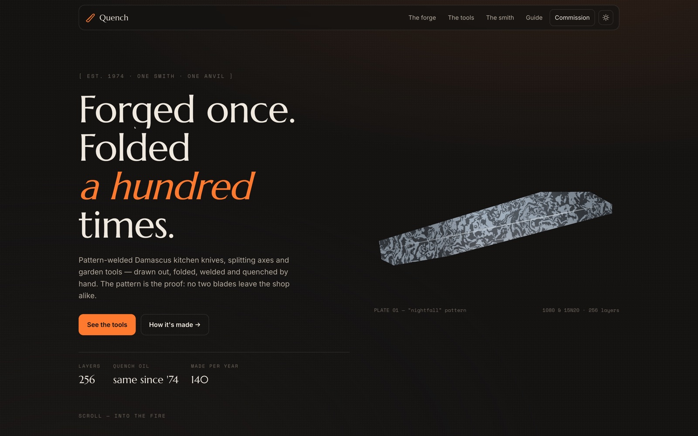

<!-- parable:beautified -->
<div align="center">

<h1>Quench</h1>

<p><strong>Heritage bladesmith — a raw-WebGL domain-warp Damascus shader on a clipped blade + a colour-coded five-heat forge.</strong></p>

<p>
  <a href="https://bswxyz.github.io/quench/"></a>
  
  
  <a href="LICENSE"></a>
</p>

<p>
  <a href="https://bswxyz.github.io/quench/"><b>Live demo</b></a>
  &nbsp;·&nbsp;
  <a href="https://bswxyz.github.io/quench/guide/">Build notes</a>
  &nbsp;·&nbsp;
  <a href="https://parable-three.vercel.app/templates">More templates</a>
</p>

<a href="https://bswxyz.github.io/quench/">
  
</a>

</div>

**Use this template** — copy the source into a new project:

```bash
npx degit bswxyz/quench my-app
```


A one-smith forge site for hand-forged Damascus blades and heritage tools — a live, domain-warped
WebGL shader paints pattern-welded steel into a clipped blade, a colour-coded five-heat forging
sequence, and a hand-illustrated tool catalogue. Part of the
[Parable design showcase](https://parable-three.vercel.app).

---

## The concept

Quench is a fictional heritage bladesmith — one smith, one anvil, ~140 pieces a year, quenched in
"the same oil since 1974." Damascus sells on its pattern (no two blades alike), so the hero doesn't
photograph a blade — it renders one, alive, so the pattern drifts as you watch. Voice is dry and
proud, the way a good maker talks: temperatures by eye, a free re-grind "for as long as the shop
stands," a guarantee measured in "the maker's life."

## Design system

- **Palette — dark is the forge, light is the polished shop.** Tokens flip on
  `:root[data-theme]`: forge-charcoal `#131211` ↔ ash `#e9e4db`, with an ember accent
  (`#ff7a2f` / `#d1571b` graded for contrast), cool `--steel` for technical meta, and a
  `--brass` detail. A dotted grain + an ember corner-glow sit in a fixed background layer.
- **Type:** `Marcellus` (a lapidary serif — heritage without nostalgia) · `Inter` (body) ·
  `Space Mono` (temperatures, steel grades, plate numbers). One face for the name, one for the
  talk, one for the measurements.
- **Signature technique:** a hand-rolled **WebGL domain-warp shader** — fbm noise warps the
  coordinates fed into more fbm, snapped to bands by `sin()` to read as folded steel, clipped to
  a blade silhouette. Named ease `cubic-bezier(.19,1,.22,1)` (a hammer's follow-through).
- **Voice:** dry, proud, unhurried. "A knife you'll own for forty years can afford to take three
  weeks."

## Stack

- **Plain HTML / CSS / vanilla JS. No framework, no build step, no bundler, no CDN** — the
  Damascus effect is raw WebGL (~90 lines of GLSL), so the page has zero runtime dependencies.
- **Inline SVG** for the six tool illustrations, the brand mark and the theme icons.
- Reveals, animated counters, the scroll-driven heat rail and the demo form are native
  `IntersectionObserver` + `requestAnimationFrame`.

## Running it locally

No install — all paths are relative:

```bash
git clone https://github.com/bswxyz/quench
cd quench
python3 -m http.server 8000      # or: npx serve .
# open http://localhost:8000
```

## Structure

```
index.html          the page (semantic sections; .js gate for progressive enhancement)
styles.css          all styling — design tokens (both themes) live in :root at the top
main.js             WebGL Damascus shader, theme toggle, reveals, counters, heat rail, demo form
guide/index.html    the "how it was built" write-up (self-contained, styled to match)
.nojekyll           tells GitHub Pages to serve files as-is
```

## Demo vs. real — what a production version would need

An intentionally-scoped demo. What's **fictional/mocked** today:

- **The forge, the smith and every tool are fictional.** Names, steel grades, hardness, prices
  and lead times are invented; the tool art is illustrative SVG, not photography of real stock.
- **No commerce.** Cards are display-only — a real shop needs a cart, checkout and payments
  (Shopify/Stripe), variant selection and live inventory. The "in stock / made to order" chips
  are static copy.
- **The commission form has no backend.** Submitting validates and confirms in-place but stores
  nothing. A real version needs an endpoint (Formspree / a serverless function / an email
  service), spam protection and an order record.
- **No analytics, no CMS.** Copy and products are hand-edited HTML.

What's **real** and reusable as-is: the WebGL domain-warp Damascus shader (with its intersection
pause, DPR cap and reduced-motion still-frame), the colour-coded `data-heat` process rail, the
scroll-linked heat meter, the full light/dark theming, and the whole responsive / reduced-motion /
keyboard layer.

## License

[MIT](LICENSE). Design & build by **Parable**.
